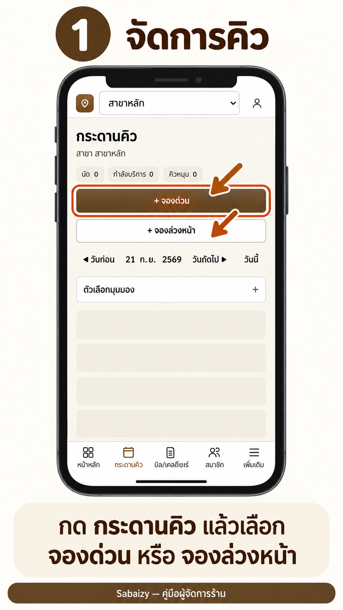
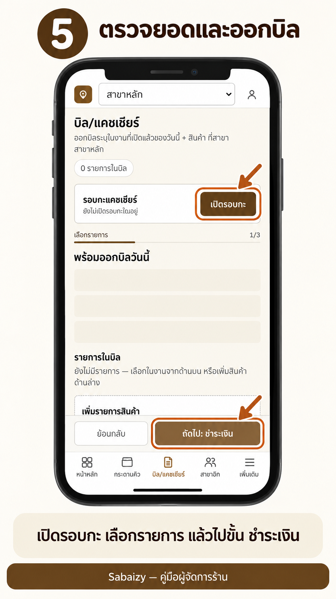
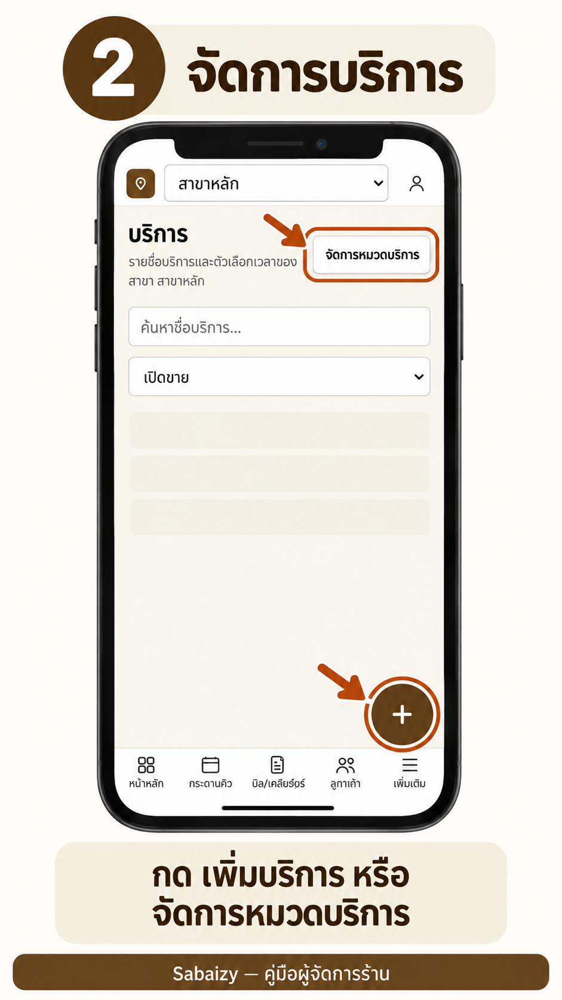
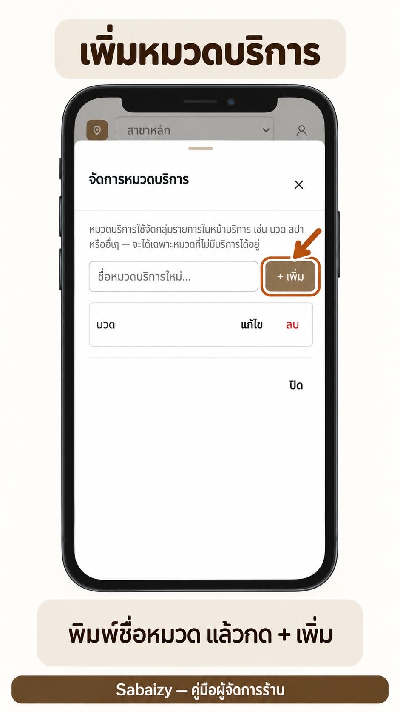
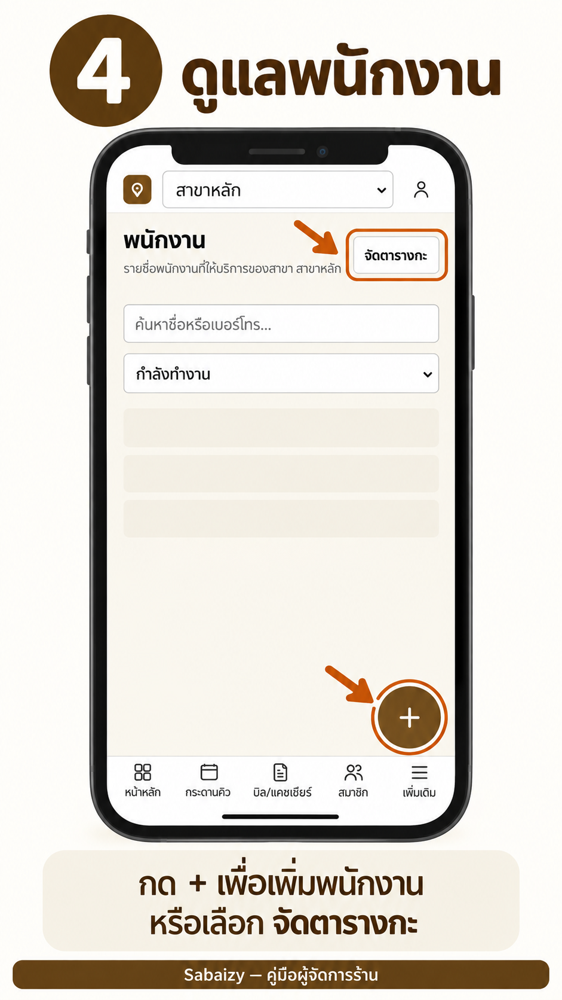

# Sabaizy — Branch Manager Guide / คู่มือผู้จัดการสาขา

> English first, Thai follows each section. / ภาษาอังกฤษมาก่อน ตามด้วยภาษาไทยในแต่ละหัวข้อ
>
> Screenshots come from the production app on a phone. Menu names match the app exactly.
> ภาพประกอบมาจากหน้าจอจริงบนมือถือ ชื่อเมนูตรงกับที่เห็นในแอป

## Contents / สารบัญ

1. [Getting started / เริ่มต้นใช้งาน](#1-getting-started--เริ่มต้นใช้งาน)
2. [Queue board / กระดานคิว](#2-queue-board--กระดานคิว)
3. [Billing and cashier shift / บิลและรอบกะแคชเชียร์](#3-billing-and-cashier-shift--บิลและรอบกะแคชเชียร์)
4. [Services / บริการ](#4-services--บริการ)
5. [Staff, shifts and attendance / พนักงาน กะงาน และลงเวลา](#5-staff-shifts-and-attendance--พนักงาน-กะงาน-และลงเวลา)
6. [Members and courses / สมาชิกและคอร์ส](#6-members-and-courses--สมาชิกและคอร์ส)
7. [Payroll and reports / ค่ามือและรายงาน](#7-payroll-and-reports--ค่ามือและรายงาน)
8. [Manager PIN / PIN ผู้จัดการ](#8-manager-pin--pin-ผู้จัดการ)
9. [Troubleshooting / แก้ปัญหาเบื้องต้น](#9-troubleshooting--แก้ปัญหาเบื้องต้น)

---

## 1. Getting started / เริ่มต้นใช้งาน

**English**

1. Open the Sabaizy address in your phone or tablet browser and tap **เข้าสู่ระบบ** (Log in).
2. Sign in with the account the owner created for you. If you have no account, ask the owner.
3. Pick your branch from the dropdown at the top (for example **สาขาหลัก**). Everything you see and change applies to that branch only.
4. Use the bottom bar to move around: **หน้าหลัก**, **กระดานคิว**, **บิล/แคชเชียร์**, **สมาชิก**, **เพิ่มเติม**. Other menus (services, courses, rooms, staff, users) are under **เพิ่มเติม**.

You only see menus your role is allowed to use.

**ไทย**

1. เปิดเว็บ Sabaizy บนมือถือหรือแท็บเล็ต แล้วกด **เข้าสู่ระบบ**
2. ล็อกอินด้วยบัญชีที่เจ้าของร้านสร้างให้ ถ้ายังไม่มีบัญชี ให้ติดต่อเจ้าของร้าน
3. เลือกสาขาจากช่องด้านบน (เช่น **สาขาหลัก**) ข้อมูลทั้งหมดที่เห็นและแก้ไขจะเป็นของสาขานั้นเท่านั้น
4. ใช้แถบเมนูด้านล่างสลับหน้า: **หน้าหลัก**, **กระดานคิว**, **บิล/แคชเชียร์**, **สมาชิก**, **เพิ่มเติม** เมนูอื่น (บริการ คอร์ส ห้อง พนักงาน ผู้ใช้) อยู่ใน **เพิ่มเติม**

ระบบแสดงเฉพาะเมนูที่บทบาทของคุณมีสิทธิ์ใช้

---

## 2. Queue board / กระดานคิว

**English**

Open **กระดานคิว**. The top shows three counters: **นัด** (appointments), **กำลังบริการ** (in service) and **คิวหมุน** (rotation queue).

- **Walk-in customer:** tap **+ จองด่วน**, choose the service, staff, room and duration (15 / 30 / 60 minutes), then **บันทึก**. The customer enters today's rotation queue.
- **Advance booking:** tap **+ จองล่วงหน้า**, pick the date and time, then **บันทึก**. Past dates are allowed for back-dated entries.
- **Change the day:** use **◀ วันก่อน** / **วันถัดไป ▶**, or **วันนี้** to jump back.
- **Change the view:** open **ตัวเลือกมุมมอง** and choose staff view or room view.
- **Open an appointment** to see its details, finish the job (**จบงาน**), deduct a course session (**ตัดคอร์ส**) or print the queue slip (**พิมพ์ใบคิว**).

The board refreshes by itself about every 20 seconds.

**ไทย**

เข้า **กระดานคิว** ด้านบนมีตัวเลข 3 ช่อง: **นัด**, **กำลังบริการ** และ **คิวหมุน**

- **ลูกค้า walk-in:** กด **+ จองด่วน** เลือกบริการ พนักงาน ห้อง และเวลา (15 / 30 / 60 นาที) แล้วกด **บันทึก** ลูกค้าจะเข้าคิวหมุนของวันนี้
- **จองล่วงหน้า:** กด **+ จองล่วงหน้า** เลือกวันและเวลา แล้วกด **บันทึก** เลือกวันย้อนหลังได้ กรณีต้องลงข้อมูลย้อนหลัง
- **เปลี่ยนวัน:** ใช้ **◀ วันก่อน** / **วันถัดไป ▶** หรือกด **วันนี้** เพื่อกลับมาวันปัจจุบัน
- **เปลี่ยนมุมมอง:** เปิด **ตัวเลือกมุมมอง** แล้วเลือกมุมมองพนักงานหรือมุมมองห้อง
- **เปิดนัด** เพื่อดูรายละเอียด กด **จบงาน** เมื่อบริการเสร็จ **ตัดคอร์ส** ถ้าลูกค้าใช้คอร์ส หรือ **พิมพ์ใบคิว**

กระดานรีเฟรชเองประมาณทุก 20 วินาที

---

## 3. Billing and cashier shift / บิลและรอบกะแคชเชียร์

**English**

Open **บิล/แคชเชียร์**.

1. **Open the cashier shift first.** In **รอบกะแคชเชียร์**, tap **เปิดรอบกะ**. Until a shift is open, the screen shows **ยังไม่มีรอบกะเปิดอยู่** and you cannot issue bills.
2. **Pick the job to bill** from **พร้อมออกบิลวันนี้**. Jobs finished on the queue board appear here. You can add products under **รายการในบิล**.
3. **Check the totals** in **ตะกร้าบิล**: **ยอดรวม**, discounts, **ยอดสุทธิ**. Tap **คำนวณยอด/ส่วนลด** after changing items.
4. Tap **ถัดไป: ชำระเงิน**. Enter the amount for each payment channel (**ช่องทางชำระเงิน**). The bill can be issued only when the payment equals the net total exactly; the screen shows **ยอดชำระตรงกับยอดสุทธิแล้ว** when it does.
5. Tap **ออกบิล**, then **ดูใบเสร็จ** if the customer wants a receipt.
6. **Review past bills** under **ประวัติบิล**.

**Cancel a bill (ยกเลิกบิล):** open the bill in **ประวัติบิล** and confirm with **ยืนยันยกเลิกบิล**. A cashier can cancel a brand-new bill that has not deducted any course session. In every other case a manager must approve with a PIN (see [section 8](#8-manager-pin--pin-ผู้จัดการ)). A reason is recorded.

**Close the shift:** at the end of the day, in **รอบกะแคชเชียร์** count the cash in the drawer and enter it (**นับได้**). The screen compares it with **ยอดระบบ** and shows **ส่วนต่าง**. Tap **ยืนยันปิดรอบกะ**. After closing, bills in that shift can no longer be edited. Reopening a closed shift (**เปิดใหม่**) needs a manager PIN.

**ไทย**

เข้า **บิล/แคชเชียร์**

1. **เปิดรอบกะก่อน** ที่ช่อง **รอบกะแคชเชียร์** กด **เปิดรอบกะ** ถ้ายังไม่เปิดจะขึ้น **ยังไม่มีรอบกะเปิดอยู่** และออกบิลไม่ได้
2. **เลือกงานที่จะออกบิล** จาก **พร้อมออกบิลวันนี้** งานที่จบบนกระดานคิวจะมาอยู่ที่นี่ เพิ่มสินค้าได้ใน **รายการในบิล**
3. **ตรวจยอด** ใน **ตะกร้าบิล**: **ยอดรวม** ส่วนลด **ยอดสุทธิ** ถ้าแก้รายการให้กด **คำนวณยอด/ส่วนลด** ใหม่
4. กด **ถัดไป: ชำระเงิน** กรอกยอดแต่ละ **ช่องทางชำระเงิน** ออกบิลได้เมื่อยอดชำระเท่ากับยอดสุทธิพอดี เมื่อตรงจะขึ้น **ยอดชำระตรงกับยอดสุทธิแล้ว**
5. กด **ออกบิล** แล้วกด **ดูใบเสร็จ** ถ้าลูกค้าต้องการ
6. **ดูบิลย้อนหลัง** ที่ **ประวัติบิล**

**ยกเลิกบิล:** เปิดบิลใน **ประวัติบิล** แล้วกด **ยืนยันยกเลิกบิล** แคชเชียร์ยกเลิกเองได้เฉพาะบิลใหม่ที่ยังไม่ตัดคอร์ส กรณีอื่นผู้จัดการต้องอนุมัติด้วย PIN (ดู[หัวข้อ 8](#8-manager-pin--pin-ผู้จัดการ)) และระบบบันทึกเหตุผลไว้

**ปิดรอบกะ:** ตอนสิ้นวัน ที่ **รอบกะแคชเชียร์** นับเงินในลิ้นชักแล้วกรอกที่ช่อง **นับได้** ระบบเทียบกับ **ยอดระบบ** และแสดง **ส่วนต่าง** จากนั้นกด **ยืนยันปิดรอบกะ** เมื่อปิดแล้วแก้บิลในรอบนั้นไม่ได้ การ **เปิดใหม่** ต้องใช้ PIN ผู้จัดการ

---

## 4. Services / บริการ

**English**

Open **เพิ่มเติม → บริการ**.

- **Search or filter:** use **ค้นหาชื่อบริการ...** and **กรองตามสถานะ**.
- **Add a service:** tap **+ เพิ่มบริการแรก** (or the add button once you have services). Fill in **ชื่อบริการ**, **ตัวเลือกเวลา** (duration and price options), **ทักษะที่ต้องใช้** and **ประเภทห้องที่ต้องใช้**, then **บันทึก**.
- **Edit:** open the service with **ดูรายละเอียด**, change fields, then **บันทึกการแก้ไข**.
- **Stop selling:** use **ปิดขาย**. The service moves to **ปิดขายแล้ว** and no longer appears when booking. Deleting needs a second tap on **ยืนยันลบ**.

- **Categories:** tap **จัดการหมวดบริการ**, type the name in **ชื่อหมวดบริการใหม่**, then save.

Prices are entered in baht and stored exactly to the satang, so there is no rounding drift.

**ไทย**

เข้า **เพิ่มเติม → บริการ**

- **ค้นหา/กรอง:** ใช้ช่อง **ค้นหาชื่อบริการ...** และ **กรองตามสถานะ**
- **เพิ่มบริการ:** กด **+ เพิ่มบริการแรก** (หรือปุ่มเพิ่มเมื่อมีบริการแล้ว) กรอก **ชื่อบริการ**, **ตัวเลือกเวลา** (ระยะเวลาและราคา), **ทักษะที่ต้องใช้**, **ประเภทห้องที่ต้องใช้** แล้วกด **บันทึก**
- **แก้ไข:** เปิดบริการด้วย **ดูรายละเอียด** แก้ข้อมูล แล้วกด **บันทึกการแก้ไข**
- **หยุดขาย:** กด **ปิดขาย** บริการจะย้ายไป **ปิดขายแล้ว** และไม่ขึ้นตอนจองคิว การลบต้องกด **ยืนยันลบ** อีกครั้ง
- **หมวดหมู่:** กด **จัดการหมวดบริการ** พิมพ์ชื่อใน **ชื่อหมวดบริการใหม่** แล้วบันทึก

กรอกราคาเป็นบาท ระบบเก็บเป็นสตางค์ตรง ๆ ไม่มีเศษคลาดเคลื่อน

---

## 5. Staff, shifts and attendance / พนักงาน กะงาน และลงเวลา

**English**

**Staff list.** Open **เพิ่มเติม → พนักงาน**. Search with **ค้นหาชื่อหรือเบอร์โทร...** and filter by status (for example **กำลังทำงาน**).

- **Add staff:** tap the **+** button, fill in **ชื่อ**, **เบอร์โทร**, **ระดับ**, **ทักษะ** and **วันเริ่มงาน**, then save.
- **Edit:** open the person, change fields, **บันทึกการแก้ไข**.
- **Deactivate:** use **ปิดใช้งาน** (confirm with **ยืนยัน?**). The person stays in history but cannot be booked. Reactivate with **เปิดใช้งาน**.

**Shift schedule.** Tap **จัดตารางกะ** on the staff page (**ตารางกะ**).

1. **เพิ่มแม่แบบกะ**: name the shift (**ชื่อกะ**, for example "เช้า") and set **เวลาเริ่ม** / **เวลาสิ้นสุด**.
2. **มอบหมายกะ**: choose the staff member, the shift, and the date range (**ตั้งแต่วันที่** – **ถึงวันที่**).
3. **Leave:** use **บันทึกวันลา**, choose the person and **ประเภทการลา**. Delete a wrong entry with **ลบวันลา?**.

Add staff before building the schedule; otherwise the page shows **เพิ่มพนักงานก่อนจัดตารางกะ**.

**Attendance.** *(Hidden from the menu in the current Basic package; available only if the owner turns it on.)* Open **ลงเวลาเข้า-ออกงาน**. For each person tap **ลงเวลาเข้า** when they arrive and **ลงเวลาออก** when they leave. The page compares with the schedule (**เทียบกะ**) and labels each person **ตรงเวลา**, **สาย**, **ออกก่อน**, **สาย+ออกก่อน**, **ขาด** or **ไม่มีกะ**.

**ไทย**

**รายชื่อพนักงาน** เข้า **เพิ่มเติม → พนักงาน** ค้นหาด้วย **ค้นหาชื่อหรือเบอร์โทร...** และกรองตามสถานะ (เช่น **กำลังทำงาน**)

- **เพิ่มพนักงาน:** กดปุ่ม **+** กรอก **ชื่อ**, **เบอร์โทร**, **ระดับ**, **ทักษะ**, **วันเริ่มงาน** แล้วบันทึก
- **แก้ไข:** เปิดรายชื่อ แก้ข้อมูล แล้วกด **บันทึกการแก้ไข**
- **ปิดใช้งาน:** กด **ปิดใช้งาน** (ยืนยันด้วย **ยืนยัน?**) ประวัติยังอยู่ แต่จองคิวให้ไม่ได้ เปิดกลับด้วย **เปิดใช้งาน**

**ตารางกะ** กด **จัดตารางกะ** ที่หน้าพนักงาน (**ตารางกะ**)

1. **เพิ่มแม่แบบกะ**: ตั้ง **ชื่อกะ** (เช่น "เช้า") และ **เวลาเริ่ม** / **เวลาสิ้นสุด**
2. **มอบหมายกะ**: เลือกพนักงาน กะ และช่วงวันที่ (**ตั้งแต่วันที่** – **ถึงวันที่**)
3. **วันลา:** กด **บันทึกวันลา** เลือกพนักงานและ **ประเภทการลา** ถ้าบันทึกผิดให้ลบด้วย **ลบวันลา?**

ต้องเพิ่มพนักงานก่อนจัดตารางกะ ไม่เช่นนั้นหน้าจะขึ้น **เพิ่มพนักงานก่อนจัดตารางกะ**

**ลงเวลา** *(ซ่อนจากเมนูในแพ็กเกจพื้นฐานปัจจุบัน ใช้ได้เมื่อเจ้าของร้านเปิดให้)* เข้า **ลงเวลาเข้า-ออกงาน** กด **ลงเวลาเข้า** เมื่อพนักงานมาถึง และ **ลงเวลาออก** เมื่อกลับ ระบบเทียบกับตารางกะ (**เทียบกะ**) แล้วแสดงสถานะ **ตรงเวลา**, **สาย**, **ออกก่อน**, **สาย+ออกก่อน**, **ขาด** หรือ **ไม่มีกะ**

---

## 6. Members and courses / สมาชิกและคอร์ส

**English**

Open **สมาชิก**.

- **Find a member:** search by name, phone or member code (**ค้นหาสมาชิก**). Use the filters for status and marketing consent.
- **Add a member:** tap **เพิ่มสมาชิก**, fill in the profile and save. Record whether the customer consents to news (**ยินยอมรับข่าวสาร**).
- **Open a member** to see the profile, course balances and history. The list also shows **คอร์สใกล้หมดอายุ** so you can follow up before courses expire.
- **Duplicates:** if the same customer was entered twice, use the merge section on the member page. The merged record shows **รวมเข้าสมาชิกอื่นแล้ว**.

Course balances are never edited directly. Every use, refund, freeze or transfer is written to a ledger and the balance is calculated from it, so each change can be traced.

Expired, frozen or refunded courses need manager approval (see [section 8](#8-manager-pin--pin-ผู้จัดการ)). Products and prices for courses are set under **เพิ่มเติม → คอร์ส/แพ็กเกจ**.

**ไทย**

เข้า **สมาชิก**

- **ค้นหา:** ค้นด้วยชื่อ เบอร์โทร หรือรหัสสมาชิกที่ช่อง **ค้นหาสมาชิก** และกรองตามสถานะหรือความยินยอมได้
- **เพิ่มสมาชิก:** กด **เพิ่มสมาชิก** กรอกโปรไฟล์ แล้วบันทึก ระบุด้วยว่าลูกค้า **ยินยอมรับข่าวสาร** หรือไม่
- **เปิดสมาชิก** เพื่อดูโปรไฟล์ ยอดคงเหลือคอร์ส และประวัติ หน้ารายการมี **คอร์สใกล้หมดอายุ** ไว้ติดตามลูกค้าก่อนคอร์สหมด
- **ข้อมูลซ้ำ:** ถ้าลูกค้าคนเดียวถูกบันทึกสองครั้ง ใช้ส่วนรวมสมาชิกในหน้าสมาชิก รายการที่ถูกรวมจะขึ้น **รวมเข้าสมาชิกอื่นแล้ว**

ยอดคงเหลือคอร์สแก้ตรง ๆ ไม่ได้ ทุกการใช้ คืนเงิน แช่แข็ง หรือโอน จะถูกบันทึกลงสมุดบัญชี (ledger) แล้วระบบคำนวณยอดจากสมุดนั้น จึงตรวจย้อนได้ทุกรายการ

คอร์สที่หมดอายุ แช่แข็ง หรือคืนเงิน ต้องให้ผู้จัดการอนุมัติ (ดู[หัวข้อ 8](#8-manager-pin--pin-ผู้จัดการ)) ส่วนตั้งสินค้าและราคาคอร์สอยู่ที่ **เพิ่มเติม → คอร์ส/แพ็กเกจ**

---

## 7. Payroll and reports / ค่ามือและรายงาน

**English**

> **Note:** payroll and reports are hidden from the menu in the current Basic package. This section applies once the owner turns them on.

**Payroll (ค่ามือ).** Open the payroll page.

- **เปิดงวดใหม่** starts a pay period. The current period (**งวดจ่ายปัจจุบัน**) lists each person's **ค่ามือ** (per-job fee), **ทิป**, deductions (**หัก**) and **รวมสุทธิ**. Tap **ดูสรุป** for the jobs behind a number.
- **ปิดงวด** closes the period and freezes the figures. Past periods are under **ประวัติงวดจ่าย**.
- Reopening a closed period needs a manager PIN.

**Reports (รายงาน).** Choose **จากวันที่** – **ถึงวันที่** (and a staff member if needed) in **ตัวกรองรายงาน**. You see daily revenue, the payment-method breakdown and staff utilisation. Tap **ส่งออก Excel** or **ส่งออก CSV** to download.

Reports are mainly for the owner and managers, and cover only the branch you selected.

**ไทย**

> **หมายเหตุ:** ค่ามือและรายงานถูกซ่อนจากเมนูในแพ็กเกจพื้นฐานปัจจุบัน หัวข้อนี้ใช้ได้เมื่อเจ้าของร้านเปิดให้

**ค่ามือ** เข้าหน้าค่ามือ

- กด **เปิดงวดใหม่** เพื่อเริ่มงวดจ่าย งวดปัจจุบัน (**งวดจ่ายปัจจุบัน**) แสดง **ค่ามือ**, **ทิป**, ยอด **หัก** และ **รวมสุทธิ** ของแต่ละคน กด **ดูสรุป** เพื่อดูใบงานที่ประกอบเป็นตัวเลข
- กด **ปิดงวด** เพื่อล็อกตัวเลข งวดที่ผ่านมาดูได้ที่ **ประวัติงวดจ่าย**
- การเปิดงวดที่ปิดแล้วกลับมาต้องใช้ PIN ผู้จัดการ

**รายงาน** เลือก **จากวันที่** – **ถึงวันที่** (และพนักงานถ้าต้องการ) ใน **ตัวกรองรายงาน** จะเห็นรายได้รายวัน สัดส่วนช่องทางชำระเงิน และการใช้งานพนักงาน กด **ส่งออก Excel** หรือ **ส่งออก CSV** เพื่อดาวน์โหลด

รายงานเน้นให้เจ้าของและผู้จัดการใช้ และแสดงเฉพาะสาขาที่เลือกอยู่

---

## 8. Manager PIN / PIN ผู้จัดการ

**English**

Some actions need a manager to confirm with a 6-digit PIN (**PIN 6 หลัก**):

- cancelling a bill that is not a brand-new, course-free bill
- reopening a closed cashier shift
- reopening a closed pay period
- refunding, freezing or expiring a course

When the dialog **ยืนยัน PIN ผู้จัดการ** appears, choose the approving manager under **ผู้จัดการที่จะอนุมัติ**, enter the PIN and tap **ยืนยัน PIN**. The approval lasts about 2 minutes and is used for that one action. Every approval is written to the audit log.

Keep your PIN private. Never share it with a cashier to "save time".

**ไทย**

บางการกระทำต้องให้ผู้จัดการยืนยันด้วย PIN 6 หลัก (**PIN 6 หลัก**):

- ยกเลิกบิลที่ไม่ใช่บิลใหม่ที่ยังไม่ตัดคอร์ส
- เปิดรอบกะแคชเชียร์ที่ปิดแล้วกลับมาใหม่
- เปิดงวดจ่ายที่ปิดแล้วกลับมาใหม่
- คืนเงิน แช่แข็ง หรือทำให้คอร์สหมดอายุ

เมื่อขึ้นหน้าต่าง **ยืนยัน PIN ผู้จัดการ** ให้เลือกผู้จัดการที่ **ผู้จัดการที่จะอนุมัติ** กรอก PIN แล้วกด **ยืนยัน PIN** การอนุมัติมีอายุประมาณ 2 นาทีและใช้ได้กับการกระทำนั้นครั้งเดียว ทุกการอนุมัติถูกบันทึกในประวัติการแก้ไข (audit log)

เก็บ PIN เป็นความลับ อย่าบอกแคชเชียร์เพื่อ "ให้ทำงานเร็วขึ้น"

---

## 9. Troubleshooting / แก้ปัญหาเบื้องต้น

| Problem / ปัญหา | Cause and fix / สาเหตุและวิธีแก้ |
| --- | --- |
| I cannot issue a bill / ออกบิลไม่ได้ | No cashier shift is open. Tap **เปิดรอบกะ**. / ยังไม่เปิดรอบกะ กด **เปิดรอบกะ** |
| Payment does not match / ยอดชำระไม่ตรง | The channels must add up to **ยอดสุทธิ** exactly. Re-check each amount. / ยอดทุกช่องทางรวมกันต้องเท่ากับ **ยอดสุทธิ** พอดี ตรวจตัวเลขอีกครั้ง |
| Cannot edit a bill / แก้บิลไม่ได้ | The shift is closed. A manager must reopen it with a PIN. / รอบกะปิดแล้ว ผู้จัดการต้องเปิดใหม่ด้วย PIN |
| A menu is missing / ไม่เห็นเมนู | Your role has no permission. Ask the owner. / บทบาทของคุณไม่มีสิทธิ์ ติดต่อเจ้าของร้าน |
| No staff or room to pick / เลือกพนักงานหรือห้องไม่ได้ | Add them first under **พนักงาน** or **ห้อง/เตียง**. / เพิ่มที่เมนู **พนักงาน** หรือ **ห้อง/เตียง** ก่อน |
| Wrong branch data / ข้อมูลไม่ใช่ของสาขาที่ต้องการ | Check the branch dropdown at the top. / ตรวจช่องเลือกสาขาด้านบน |
| Action failed with "ลองใหม่" / ขึ้นข้อความให้ลองใหม่ | Check your connection and try again. If it keeps failing, tell the owner. / ตรวจอินเทอร์เน็ตแล้วลองใหม่ ถ้ายังไม่ได้ให้แจ้งเจ้าของร้าน |
